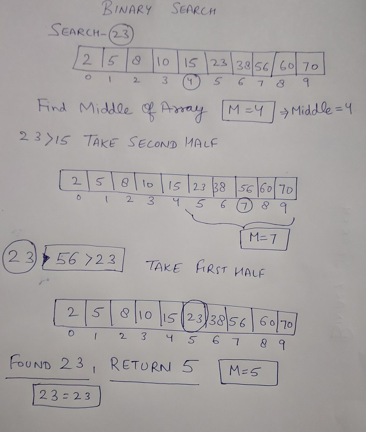

# Binary Search

- Binary Search works on the principle of divide and conquer.  
- For this algorithm to work properly, the data collection should be in the sorted form.
- The time complexity is O(Log n).

## Algorithm 
Let the searched element be x.  
Find the middle of the array, divide the array in half.        
Search a sorted array by repeatedly dividing the search interval in half.
Begin with an interval covering the whole array.If the value of the search
key is less than the item in the middle of the interval, narrow the interval to the first lower half. 
Otherwise narrow it to the second upper half

    1.Compare x with the middle element.
    2.If x matches with middle element, we return the mid index.
    3.Else If x is greater than the mid element, then x can only lie in right half subarray after the mid element. So we recur for right half.
    4.Else (x is smaller) recur for the left half
    

## High Level Flow Of The Algorithm

